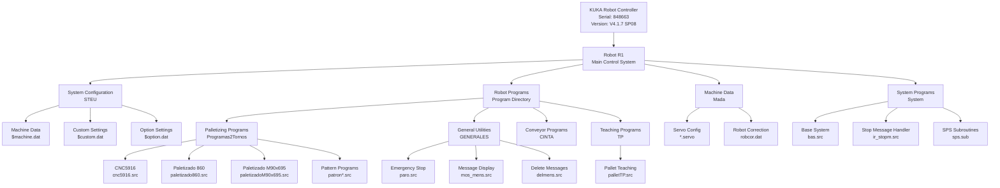

# Erreka Smart Pal - KUKA Robot Palletizing System

[](https://www.kuka.com/)
[](https://www.kuka.com/)
[](https://www.kuka.com/)

This repository contains the complete control program for an Erreka Smart Pal robotic palletizing system powered by a KUKA industrial robot (Serial Number: 848663). The system is designed to automate the palletizing process for CNC lathe operations, handling parts from multiple machines (Tornos lathes).

## 🤖 System Overview



## 📁 Repository Structure

```
errekaSmartPal/
├── am.ini                          # Archive configuration
├── C/                              # Windows/PC side files
│   ├── KRC/                        # PC-side KRC files
│   └── WINDOWS/                    # Windows-specific files
└── KRC/                            # KUKA Robot Controller files
    ├── R1/                         # Robot 1 configuration
    │   ├── Mada/                   # Machine data files
    │   │   ├── $machine.dat        # Machine configuration
    │   │   ├── $robcor.dat         # Robot correction data
    │   │   ├── *.servo             # Servo configuration files
    │   │   └── *.upg               # Upgrade files
    │   ├── Program/                # Robot programs directory
    │   │   ├── Programas2Tornos/   # Main palletizing programs for lathes
    │   │   │   ├── cnc5916.src/dat # CNC 5916 program
    │   │   │   ├── m72x860.src/dat # M72x860 program
    │   │   │   ├── paletizado*.src # Palletizing routines
    │   │   │   └── patron*.src     # Pattern programs
    │   │   ├── GENERALES/          # General utility programs
    │   │   │   ├── paro.src        # Emergency stop routine
    │   │   │   ├── mos_mens.src    # Message display routine
    │   │   │   └── delmens.src     # Delete messages routine
    │   │   ├── CINTA/              # Conveyor programs
    │   │   ├── ViejosEnCaballete/  # Old/archived programs
    │   │   └── programa_patr.src   # Main pattern program
    │   ├── System/                 # System-level programs
    │   │   ├── bas.src             # Base system program
    │   │   ├── ir_stopm.src        # Interrupt stop message handler
    │   │   └── sps.sub             # SPS subroutines
    │   └── TP/                     # Teaching pendant programs
    │       ├── p00.src             # Teaching program
    │       └── palletTP.src        # Pallet teaching program
    └── STEU/                       # Controller configuration
        ├── $config.dat             # Controller configuration
        └── Mada/                   # Controller machine data
            ├── $machine.dat        # Machine settings
            ├── $custom.dat         # Custom settings
            └── $option.dat         # Optional settings
```

## 🎯 Key Features

- **Multi-Machine Support**: Handles palletizing for multiple CNC lathes (Tornos machines)
- **Flexible Pattern Generation**: Multiple pattern programs for different part configurations
- **Safety Systems**: Emergency stop routines and message handling
- **Teaching Mode**: Teaching pendant programs for easy setup and calibration
- **Modular Design**: Separated utility functions and palletizing logic

## 🔧 Program Types

### Palletizing Programs (Programas2Tornos)
- **cnc5916**: Palletizing routine for CNC machine 5916
- **m72x860**: Palletizing for M72x860 configuration
- **paletizado860**: Standard 860mm pallet configuration
- **paletizadoM90x695**: M90x695mm pallet configuration
- **patron/pat programs**: Various pattern generation routines for different layouts

### Utility Programs (GENERALES)
- **paro**: Emergency stop and safety brake routine
- **mos_mens**: Display messages on the teach pendant
- **delmens**: Clear/delete messages from display

### System Programs
- **bas**: Base system initialization and core functions
- **ir_stopm**: Interrupt handler for stop messages
- **sps**: Programmable Logic Controller (PLC) subroutines

## 📋 Technical Specifications

- **Robot Serial Number**: 848663
- **Controller Version**: KUKA V4.1.7 SP08
- **Programming Language**: KUKA Robot Language (KRL)
- **Archive Date**: 2025-05-22

## 🚀 Usage

### File Types
- **`.src` files**: KUKA Robot Language source code (human-readable)
- **`.dat` files**: Data files containing position data, variables, and configurations
- **`.upg` files**: Upgrade/update files for machine data
- **`.servo` files**: Servo motor configuration files

### Loading Programs
1. Connect to the KUKA controller via the teach pendant or network
2. Navigate to the Program directory (R1/Program)
3. Select the desired program (e.g., paletizado860.src)
4. Load and verify the program before execution

### Safety Considerations
⚠️ **Always ensure**:
- The workspace is clear before running programs
- Emergency stops are accessible
- Safety fencing is in place
- Operators are trained on the system

## 🛠️ Development

### Modifying Programs
1. Programs can be edited using:
   - KUKA WorkVisual (PC-based development environment)
   - Teach pendant (inline editing)
   - Text editor (for .src files, then upload to controller)

2. Always backup existing programs before modifications
3. Test in simulation mode first
4. Verify position data in .dat files matches physical layout

### Adding New Patterns
1. Create new .src file in Programas2Tornos directory
2. Define pattern layout and positions
3. Create corresponding .dat file with position data
4. Test with single-step execution mode

## 📝 License

This is proprietary industrial automation code. All rights reserved.

## 🤝 Support

For technical support or questions about this system, contact your KUKA service representative or Erreka Automation team.

---

**Note**: This system controls heavy industrial equipment. Only trained personnel should operate, modify, or maintain this system.
